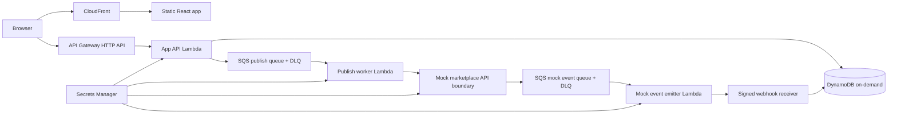

# Approach — Marketplace Aggregator Prototype

## Approach summary

I would use a hybrid API-driven and message-driven architecture. Marketplace publishing starts as a synchronous API request from the seller UI, but the actual third-party interaction is asynchronous through SQS because marketplace APIs are rate-limited, sometimes unavailable, and prone to duplicate callbacks. I would avoid an agentic system for this slice: the workflow is deterministic, audit-sensitive, and better modeled as explicit commands, retries, idempotency keys, and signed events. Agents could help later with support triage or listing optimization, but not with the core publish/sale ledger.

## Architecture

**AWS choices:** CloudFront + S3 keeps the UI cheap and globally cached. API Gateway HTTP API is enough for a small JSON API and is cheaper/simpler than REST API. Lambda avoids idle server cost. SQS decouples seller actions from flaky marketplace calls and gives retries/DLQs. DynamoDB on-demand fits the access pattern: query listings by tenant and recent activity by listing without managing capacity. Secrets Manager stores the mock signing secret. There is no VPC, NAT gateway, provisioned DB, or always-on container service.

## Reference marketplace: eBay

I would choose eBay as the conceptual reference because it has mature seller APIs, a sandbox, OAuth-based authorization, publish workflows, and event/notification concepts. The real Inventory API shape maps well to this prototype: an item becomes an inventory item, then an offer, then a published listing. Important production pitfalls are that eBay publish requirements are more complex than the prototype fields: sellers need inventory locations, categories, quantity, condition, marketplace, price, and business policies such as payment, fulfillment, and returns. Some updates are capped, and API usage/rate limits vary by API and application. Notifications also require careful endpoint validation, signature/integrity verification, retry handling, and duplicate detection.

## Safety

- **Credential storage:** Store seller OAuth refresh tokens in Secrets Manager or encrypted DynamoDB fields with KMS; never commit tokens. The prototype only uses a generated mock HMAC secret.
- **Tenant isolation:** All records carry `tenantId`; production auth would derive tenant from Cognito/Auth.js claims, not a request body. DynamoDB keys should include tenant boundaries and IAM should be least-privilege per service.
- **Publish idempotency:** Use a deterministic idempotency key per `(tenant, listing, marketplace, publishVersion)`. Retries can call the marketplace again without creating duplicate marketplace listings.
- **Webhook idempotency:** Verify HMAC signature and timestamp, conditionally write `WEBHOOK#eventId`, then update activity. Duplicate events return success without mutating the feed twice.
- **Retry strategy:** SQS handles retries with DLQs. Marketplace 429/5xx errors are retryable with backoff; validation/4xx errors should stop and mark the listing as failed.
- **Abuse resistance:** In production, protect seller APIs with auth, add per-tenant rate limits, validate payload sizes, and remove the public demo event injector.

## Cost

At 10 sellers, 1k listings, and 10k events/month, the stack should be very low cost. Lambda, SQS, DynamoDB on-demand, API Gateway HTTP API, S3, and CloudFront are all usage-based. The prototype's expected monthly usage is far below typical free-tier or low-tier thresholds, aside from small Secrets Manager and CloudWatch log costs. A realistic estimate is under a few dollars/month in a US region if logs are retained briefly and payloads stay small.

The first cost wall is unlikely to be Lambda compute. It will come from high event/API volume, large photos, chatty polling, verbose CloudWatch logs, or adding always-on infrastructure such as NAT gateways, RDS/Aurora, OpenSearch, or ECS services. If read traffic grows, I would add targeted GSIs and cache only the listing/feed views that actually become hot.

## What I would cut and build next

For the one-day prototype, I would cut real eBay OAuth, photo uploads, polished UI, multi-tenant auth, and full event replay UI. I would keep idempotency, retries, webhook signing, and DLQs because those are the core integration risks.

Next, I would build real seller auth, the eBay OAuth connection flow, marketplace adapter interfaces, normalized event schemas, a DLQ redrive path, CloudWatch alarms, and presigned S3 photo upload. After that, I would add marketplace-specific validation before publish so sellers get actionable errors before a third-party API rejects the listing.
