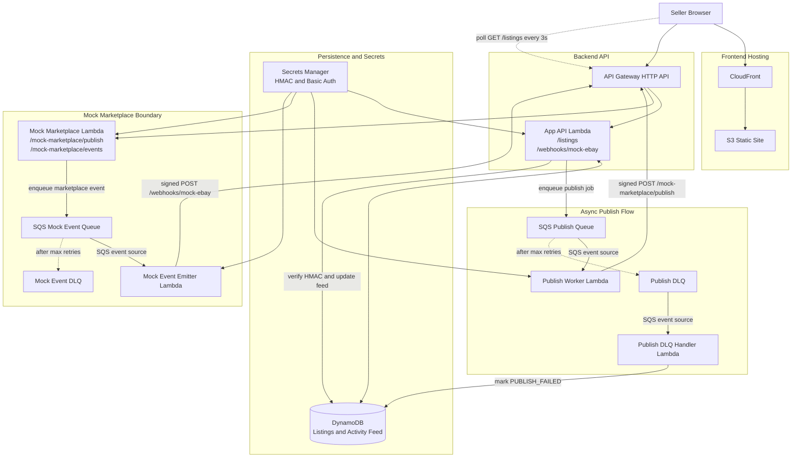

# Marketplace Aggregator — AWS Prototype

Minimal serverless slice for a marketplace aggregator. A seller can create a listing once, the backend publishes it to a mocked eBay-like marketplace asynchronously, and marketplace events flow back into an aggregated listing activity feed.

## What this implements

- Frontend served from S3 behind CloudFront.
- `POST /listings` persists a listing and enqueues publish work.
- Mock marketplace boundary with its own Lambda route: `POST /mock-marketplace/publish`.
- Mock publish is asynchronous, has a synthetic 15% failure/rate-limit rate, and relies on SQS retries. (failure rate increased to 30% for demo purpose to show retry and idempotency in action)
- Webhook receiver: `POST /webhooks/mock-ebay` verifies HMAC signatures and deduplicates events.
- DynamoDB stores listings, marketplace publish idempotency records, webhook dedupe records, and per-listing activity.
- Manual/demo event trigger from the UI and CLI for `new_comment` and `item_sold`.
- CDK-based deploy/destroy.

## Architecture



## Prerequisites

- Node.js 20+
- AWS CLI configured for the target account/region
- AWS CDK bootstrap completed once in the account/region:

```bash
npx cdk bootstrap
```

## Deploy

From a clean clone, run one command:

```bash
npm run deploy
```

CDK outputs:

- `SiteUrl` — open this in the browser.
- `ApiUrl` — use this for smoke tests or manual event scripts.

## \ud83d\udd10 Basic Auth credentials

The user-facing API endpoints are protected by HTTP Basic Authentication:

- `GET /listings`
- `POST /listings`

The following endpoints are intentionally **not** protected by Basic Auth:

- `POST /webhooks/mock-ebay` (secured via HMAC signature)
- `/mock-marketplace/*` (represents the external marketplace boundary)

Credentials are generated automatically in AWS Secrets Manager during deployment.

To retrieve them:

```bash
aws secretsmanager get-secret-value \
  --secret-id MarketplaceAggregatorStack-BasicAuthSecret \
  --query SecretString \
  --output text
```

This returns JSON like:

```json
{ "username": "demo", "password": "<generated-password>" }
```

Use them in requests:

```bash
curl -X GET https://YOUR_API_ID.execute-api.YOUR_REGION.amazonaws.com/listings \
  -u demo:<generated-password>
```

## Try it in the browser

1. Open `SiteUrl`.
2. Create a listing with title, description, and price.
3. The listing starts as `PENDING_PUBLISH`.
4. Wait a few seconds; if the mock marketplace randomly fails, SQS retries. Eventually the listing should become `PUBLISHED` unless retries exhaust.
5. Click **Mock comment** or **Mock sale** on a published listing.
6. Confirm the activity feed updates.

## Publish status + retry

Listings move through a small publish lifecycle:

- **Queued** (`PENDING_PUBLISH`)
- **Publishing** (`PUBLISHING`)
- **Retrying** (`PUBLISH_RETRYING`) — automatic retries for transient failures
- **Published** (`PUBLISHED`)
- **Needs attention** (`PUBLISH_FAILED`) — either a non-retryable rejection or retry exhaustion
- **Sold** (`SOLD`)

If publishing fails, the UI exposes a **Retry publish** action which calls:

`POST /listings/{listingId}/retry-publish`

This is only allowed when the listing is in `PUBLISH_FAILED`. It re-queues publish work for the existing listing (no duplicate listing record is created), reuses the same publish idempotency key, and resets `publishAttemptCount` for the new publish run.

## Smoke test against the deployed stack

```bash
BASIC_AUTH_PASSWORD=<generated-password> npm run smoke -- https://YOUR_API_ID.execute-api.YOUR_REGION.amazonaws.com
```

The script creates a listing, waits for publish, triggers a mock comment, triggers a mock sale, and prints the resulting activity.

## Trigger events manually

```bash
npm run trigger:event -- https://YOUR_API_ID.execute-api.YOUR_REGION.amazonaws.com LISTING_ID MARKETPLACE_LISTING_ID new_comment "Is this still available?"
npm run trigger:event -- https://YOUR_API_ID.execute-api.YOUR_REGION.amazonaws.com LISTING_ID MARKETPLACE_LISTING_ID item_sold
```

## API sketch

### `POST /listings`

```json
{
  "title": "Vintage camera",
  "description": "Works, includes strap",
  "price": 125.5
}
```

### `GET /listings`

Returns all demo-tenant listings and their latest activity entries.

### `POST /mock-marketplace/events`

Demo-only event injector. In production this would not be public; it exists here so reviewers can trigger events without real eBay credentials.

```json
{
  "eventType": "new_comment",
  "listingId": "...",
  "marketplaceListingId": "MOCK-...",
  "payload": {
    "buyerAlias": "buyer_123",
    "commentText": "Is this still available?"
  }
}
```

## Data model

Single DynamoDB table with composite primary key:

| Entity | PK | SK | Notes |
| --- | --- | --- | --- |
| Listing | `TENANT#demo` | `LISTING#<listingId>` | Query all listings for the demo tenant. |
| Activity | `LISTING#<listingId>` | `ACTIVITY#<isoTime>#<eventId>` | Query recent feed entries per listing. |
| Webhook dedupe | `WEBHOOK#<eventId>` | `DEDUP` | Conditional write + TTL. |
| Mock idempotency | `MOCK_PUBLISH#<idempotencyKey>` | `META` | Prevents duplicate marketplace listings on retries. |

## Safety notes

- No AWS keys or marketplace tokens are committed.
- The mock and webhook share an HMAC signing secret generated in AWS Secrets Manager.
- Webhook validation checks `x-mock-timestamp` and `x-mock-signature` over `timestamp.body`.
- Webhook events are deduplicated by event ID before the activity feed is updated.
- Publish requests carry a deterministic idempotency key: `tenant:listing:marketplace:version`.
- SQS gives retry/backoff; each queue has a DLQ.
- No VPC or NAT gateway is used, which avoids idle hourly network cost.
- The public demo event injector is intentionally out of production scope. For a real product, protect it behind auth or remove it entirely.

## Cost to leave running for one day

For a one-day prototype run with a handful of listings/events, expected cost is near zero to a few cents, depending on account free-tier status and log volume. The only persistent paid service likely to show a visible line item is Secrets Manager, roughly pennies per day for one secret. S3/CloudFront/API Gateway/Lambda/DynamoDB/SQS usage should be tiny at demo volume.

At the assignment's sizing target — about 10 sellers, 1k listings, and 10k events/month — this remains well under a few dollars/month in a typical US region if payloads stay small and logs are retained briefly. The first real cost wall is not compute; it is usually API/event volume, verbose CloudWatch logs, or adding always-on services such as NAT gateways, provisioned databases, or OpenSearch.

## CloudWatch metrics / alarms to add first

1. **SQS DLQ depth**
   - `ApproximateNumberOfMessagesVisible > 0`
   - Queues: `PublishDlq`, `MockEventDlq`
   - Why: failed publish jobs or failed webhook deliveries need operator attention.

2. **Lambda errors**
   - `Errors > 0`
   - Functions: API, publish worker, mock marketplace, event emitter
   - Why: catches broken routes, failed retries, bad payload handling, or integration issues.

3. **Lambda throttles**
   - `Throttles > 0`
   - Why: indicates concurrency limits or traffic spikes.

4. **API Gateway 5xx rate**
   - `5XXError > 0`
   - Why: user-facing backend failure.

5. **API Gateway 4xx spike**
   - Sudden increase in `4XXError`
   - Why: could indicate bad clients, auth failures, webhook signature issues, or abuse.

6. **DynamoDB throttles / system errors**
   - `ThrottledRequests > 0`
   - `SystemErrors > 0`
   - Why: indicates persistence-layer issues.

7. **Queue age**
   - `ApproximateAgeOfOldestMessage`
   - Queues: `PublishQueue`, `MockEventQueue`
   - Why: detects stuck async processing before messages hit the DLQ.

8. **CloudWatch log retention**
   - Set Lambda log groups to 7–14 days for prototype
   - Why: prevents silent log-storage cost growth.

## Tear down

```bash
npm run destroy
```

This destroys the stack, including the DynamoDB table and S3 bucket contents. Do not use this removal policy for production data.

## What I would build next

1. Cognito or Auth.js-backed seller auth and tenant isolation from real identity claims.
2. Real eBay OAuth connection flow, token refresh, and per-seller credential storage.
3. EventBridge bus for normalized marketplace events and replay tooling.
4. DLQ redrive UI and operator alerts.
5. Product photo upload via presigned S3 URLs.
6. Integration-specific adapters for eBay, Facebook Marketplace, and additional marketplaces.
